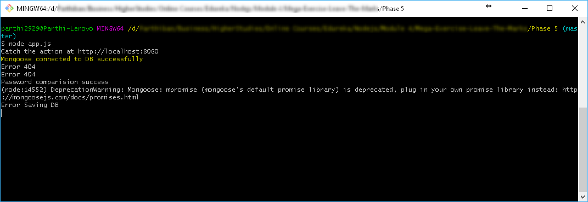
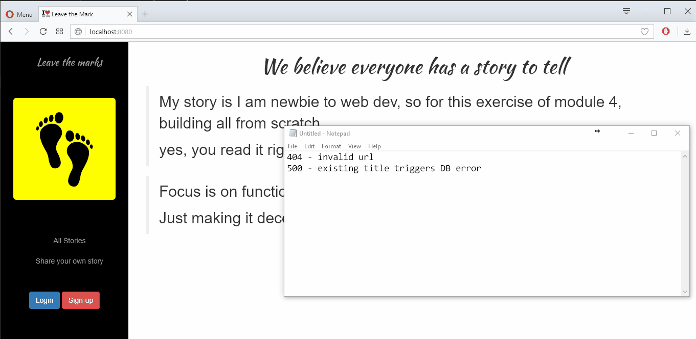

# leave-the-marks-parthi2929
Step by step development of leave the marks app of Module 4 and 5 in Edureka Nodejs training program

Update: 16th Oct 2017 5:05 PM
Phase 5 (Final): mlab.com online mongoDB service connected instead of local. 
All are working fine just like earlier in local DB
Ready for Heroku Deployment.

Update: 16th Oct 2017 4:40 PM
Phase 5: Chalk, 404 and 500 error handling updated. 

Chalk:

404 & 500 errors:

