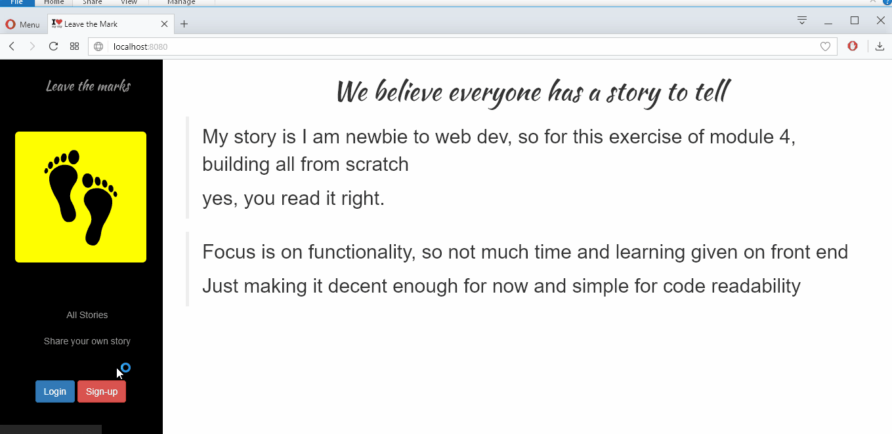

# leave-the-marks-parthi2929
Step by step development of leave the marks app of Module 4 and 5 in Edureka Nodejs training program

Update: 11th Oct 2017
Phase 3 Step 1 
Signup and Login now updated in DB

Test Instructions:
1. Make sure 
	MongoDB server is running locally
	link is correct (eg: mongodb://localhost:27017/test)
		if not change dbURI in db.js accordingly
	
2. What you see is user data getting stored in DB and retrieved. 
Stories, not yet. 
	Signup  -  "test"
	Login	-  "test"
	close website
	Signup "test" again. Should not work.
	Login "test". Should work.

Also MyUnderstanding.ppt is included in this release, for better understanding.

