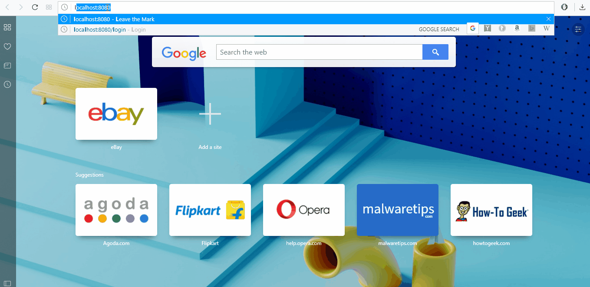

# leave-the-marks-parthi2929
Step by step development of leave the marks app of Module 4 and 5 in Edureka Nodejs training program

Update: 10th Oct 2017
Phase 2 Step 3 
Sidebar log buttons and logout pages updated. 

Update: 10th Oct 2017
Phase 2 Step 4 
Newstory page has direct link in home page. So it is possible, user may click that without logging in.
So we have to validate if he already logged in and allow. If not, direct him to login page.

